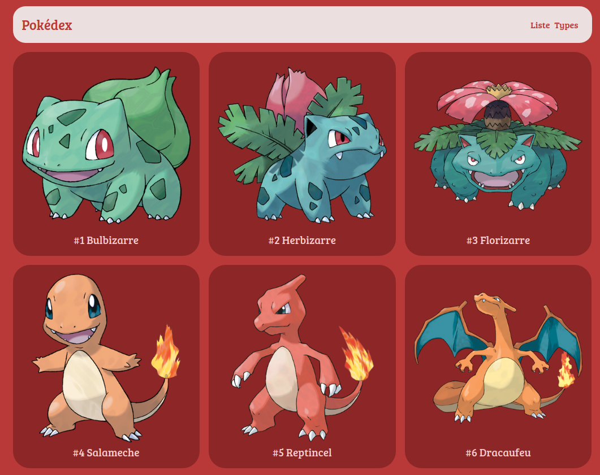

# :dragon_face: Pokedex V1 

## Create a pokedex (dictionary of all pokemon where each one has combat characteristics as well as one or two types).

## Illustration

## Language
- html5
- css3
- javascript vanilla
- NodeJS
- PostGreSQL
- express / ejs / dotenv
- sequelize

## Goals 
- Fundamentals (Javascript)
- Architecture MVC
- ORM and DB

## Status
Project not completed

## Context
Project carried out during my training as a web developer